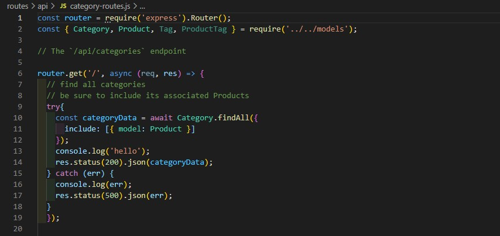

# E-Commerce-Back-End
Our task is to build the back end for an e-commerce site by modifying starter code. You’ll configure a working Express.js API to use Sequelize to interact with a MySQL database.

## User Story

AS A manager at an internet retail company
I WANT a back end for my e-commerce website that uses the latest technologies
SO THAT my company can compete with other e-commerce companies

## Acceptance Criteria
GIVEN a functional Express.js API
WHEN I add my database name, MySQL username, and MySQL password to an environment variable file
THEN I am able to connect to a database using Sequelize
WHEN I enter schema and seed commands
THEN a development database is created and is seeded with test data
WHEN I enter the command to invoke the application
THEN my server is started and the Sequelize models are synced to the MySQL database
WHEN I open API GET routes in Insomnia for categories, products, or tags
THEN the data for each of these routes is displayed in a formatted JSON
WHEN I test API POST, PUT, and DELETE routes in Insomnia
THEN I am able to successfully create, update, and delete data in my database

## Database Models
Your database should contain the following four models, including the requirements listed for each model:

Category

id

Integer.

Doesn't allow null values.

Set as primary key.

Uses auto increment.

category_name

String.

Doesn't allow null values.

Product

id

Integer.

Doesn't allow null values.

Set as primary key.

Uses auto increment.

product_name

String.

Doesn't allow null values.

price

Decimal.

Doesn't allow null values.

Validates that the value is a decimal.

stock

Integer.

Doesn't allow null values.

Set a default value of 10.

Validates that the value is numeric.

category_id

Integer.

References the Category model's id.

Tag

id

Integer.

Doesn't allow null values.

Set as primary key.

Uses auto increment.

tag_name

String.

ProductTag

id

Integer.

Doesn't allow null values.

Set as primary key.

Uses auto increment.

product_id

Integer.

References the Product model's id.

tag_id

Integer.

References the Tag model's id.

# Link to Walkthrough

pt 1 - https://drive.google.com/file/d/1Kt7wtyJyBjEIpCtwVDqmGaKIW-1UVpVw/view

pt 2 - https://drive.google.com/file/d/1N-wuH9WzX2JsTtkOMjprHXhVFtUv6wOM/view

## media

Example of code that runs get operator to pull category seeds to insomnia

## technologies used

Insomnia
Node
MySQL
Express
Sequelize
CRUD operators

Contributors
Anyone can contribute to this code

## Author

Oscar Bryant
https://github.com/oscarcbryant
